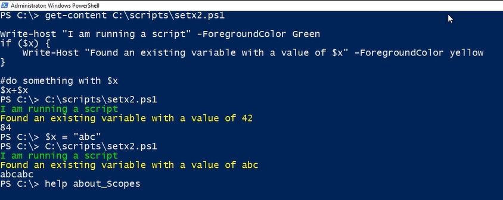
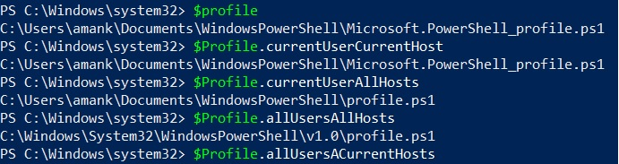
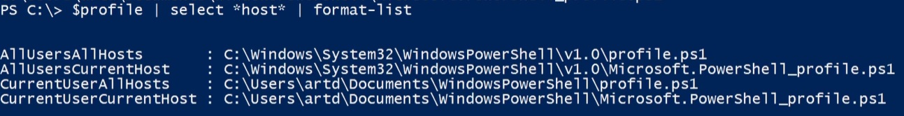

## Resources to Help you

### PowerShell.org

### By default power shell will not run scripts

#### .ps1, .psm1, .ps1xml files

## Execution Policy

Acess for Scripts to run

- Restricted
- Remote Signed
- AllSigned
- UnRestricted
- ByPass

### The Least suggested is Remote Signed

#### Open Power Shell as Administrator

```
Set-ExecutionPolicy RemoteSigned
                or
Set-ExecutionPolicy unrestricted -Force
```

#### RemoteSigned says run any script made locally but not downloaded from internet unless its digitally Signed

## This Command will open up the current folder in explorer

```
invoke-item .
```

### This will checkout the unblock checkbox on the file property downloaded via internet

```
unblock-file filnameWithAddress
```

- Power Shell Executes in a given scope
- Things defined in scope ends with it
- Scripts runs in their own scope

### Scopes

- Global
  - Powershell opens in this scope
- Script
  - Scrips runs in their own internal Scope.
- Local
  - The current scope. The local scope can be the global scope or any other scope.
- Private
- Numbered Scops

#### If follows Lexical Scoping

We can create or write in only current scope

#### We can use -Scope parameter in case a variable needs to declare in a particular scope.

#### Everything in PowerShell ISE runs in Global Scope

### To learn more about scopes

```
help about-scopes
```



### To get all the variables in the global scope, type:

```
Get-Variable -Scope global
```

### We can create a powershell profile to meet your needs as per Ide or different conditions

It has

- Hard Coded File Paths
- You will have to create them

Some of the PowerShell Profile e.g,



> Even when I am executing my script in VScode or somewhere else It has some Powershell Profile


