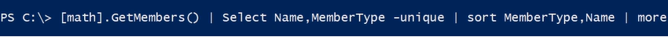

## Difference Between Powershell and cmd

1. ### PowerShell uses cmdlets, which are self-contained programming objects that expose the underlying administration options inside of Windows.

2. ### PowerShell uses pipes to chain together cmdlets and share input/output data the same way as other shells, like bash in linux.
3. ### One of the (many) neat functions of PowerShell is the ability to create aliases for different cmdlets. Aliases allow a user to configure their own names for different cmdlets or scripts, which makes it more straightforward for a user to switch back and forth between different shells: ‘ls’ is a linux bash command that displays directory objects, like the ‘dir’ command. In PowerShell, both ‘ls’ and ‘dir’ are an alias for the cmdlet ‘Get-ChildItem.’

4. ### CMD is the older “shell” or “batch” language going back in some form (command.com) to the original DOS operating system.

5. ### PowerShell is the new and vastly improved shell and programming language first made available as an add-on and now included (and now enabled) in the Windows operating systems.
6. ### PowerShell passes and returns OBJECTS (structured data with methods, events, and properties) to other commands and returns these objects from most commands as well while CMD produces only text.

## Resources to Help you

### PowerShell.org

### By default power shell will not run scripts

#### .ps1, .psm1, .ps1xml files

## Execution Policy

Acess for Scripts to run

- Restricted
- Remote Signed
- AllSigned
- UnRestricted
- ByPass

### The Least suggested is Remote Signed

#### Open Power Shell as Administrator

```
Set-ExecutionPolicy RemoteSigned
                or
Set-ExecutionPolicy unrestricted -Force
```

#### RemoteSigned says run any script made locally but not downloaded from internet unless its digitally Signed

## This Command will open up the current folder in explorer or with the default program

```
invoke-item .
```

### This will checkout the unblock checkbox on the file property downloaded via internet

```
unblock-file filnameWithAddress
```

- Power Shell Executes in a given scope
- Things defined in scope ends with it
- Scripts runs in their own scope

### Scopes

- Global
  - Powershell opens in this scope
- Script
  - Scrips runs in their own internal Scope.
- Local
  - The current scope. The local scope can be the global scope or any other scope.
- Private
- Numbered Scops

#### If follows Lexical Scoping

We can create or write in only current scope

#### We can use -Scope parameter in case a variable needs to declare in a particular scope.

#### Everything in PowerShell ISE runs in Global Scope

### To learn more about scopes

```
help about-scopes
```


### To get all the variables in the global scope, type:

```
Get-Variable -Scope global
```

### We can create a powershell profile to meet your needs as per Ide or different conditions

It has

- Hard Coded File Paths
- You will have to create them

Some of the PowerShell Profile e.g,


> Even when I am executing my script in VScode or somewhere else It has some Powershell Profile


> A basic script file is a text file with .ps1 file extension

- Use # to indicate comments


### Another Example

> It will create and Html file with the results and Also will add css to it


### We can also pass parameters to the script


> use Help Script Name and it will tell you the parameters the script is expecting


> Using IF Else


> Enumeration

#### Two ways to do it

- ForEach-Object
- For Each

1. ForEach-Object


2. ForEach


> In the ForEachObject way we can pipe the result to the end while we can't do the same in forEach 2nd Method

### Array


#### Array Operations


### HashTables


> Also, we can Update HashTable


### We also have one ordered HashTable in PS

### Splatting in HashTable


**Here we reference the variable using @**

## Objects in Pipeline

- Select
- New
- [pscustomobject]

### We also have try/catch in PS

### With String Data Type we can have all the methods that we use in Java/C++

### Same Goes for Date Data Type


> Piping the Date variable with get-member and then with more can be done with other data types too

### To see everything which is in date referenced variable we can have

```
$now = get-Date
$now | select *
$now.dayOfWeek
```

### PS has a class call Math class or more directly its in dotnet


> To find all things in Math Class



> To invoke methods


### We also have Powershell script that orchestrates or runs other powershell commands, functions and scripts

### Things to learn further in PowerShell


## Other resource

- PowerShell.org
- Http://bit.ly/PSUserGroups
